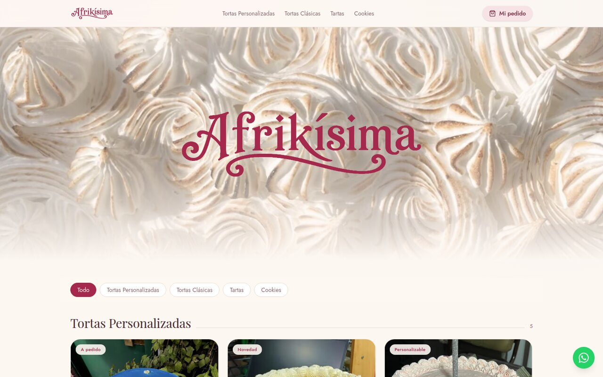
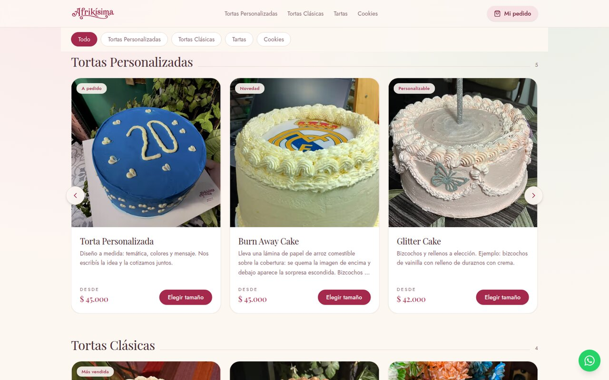
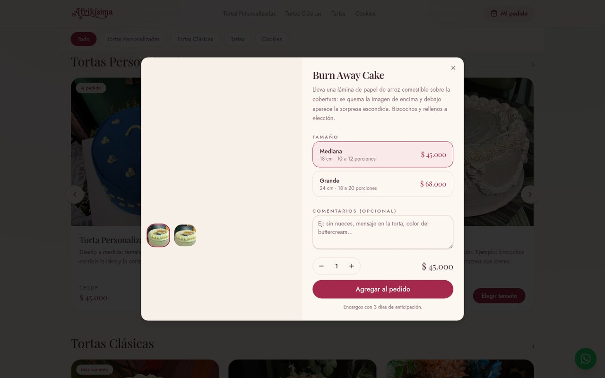
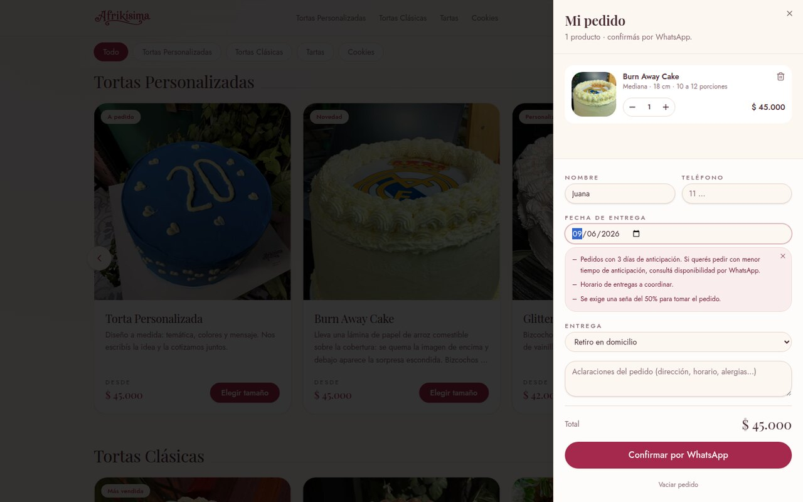
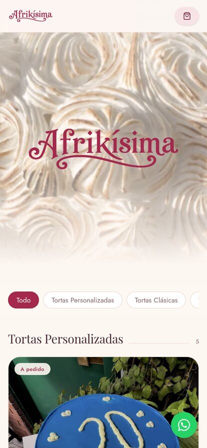
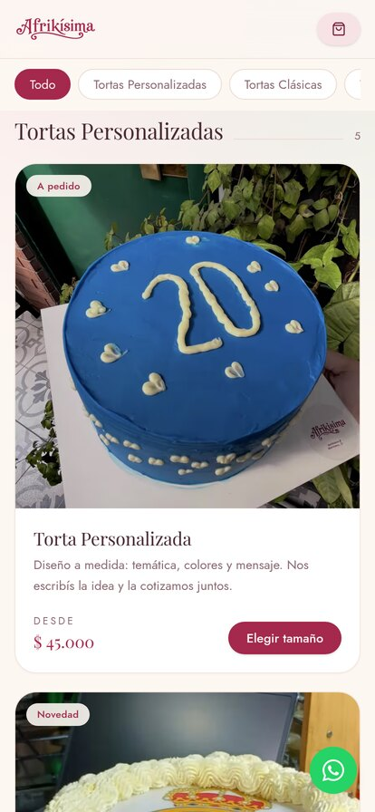

<div align="center">
  

  <p><strong>Tienda web de la pastelería Afrikísima</strong><br>
  Catálogo de tortas con selección de tamaño y pedidos por WhatsApp.</p>

  <p>
    
    
    
    
    
  </p>
</div>

---

Sitio de una pastelería artesanal de Tres de Febrero, Buenos Aires. La portada
no tiene texto de presentación: se entra directo al catálogo. El cliente elige
producto y tamaño, arma el pedido y lo confirma por WhatsApp con el mensaje ya
redactado.

No hay pasarela de pago ni base de datos: el pedido se coordina por WhatsApp,
así que el sitio corre entero en el plan gratuito de cualquier hosting de Next.js.

## Capturas

|  |  |
| :--: | :--: |
|  |  |
| **Portada** — logo sobre la foto, catálogo inmediato | **Catálogo** — carrusel por categoría en escritorio |
|  |  |
| **Ficha** — galería, tamaños y comentarios | **Pedido** — datos, fecha de entrega y condiciones |

<div align="center">
  
  &nbsp;&nbsp;
  
  <p><em>En mobile el carrusel se reemplaza por una grilla vertical.</em></p>
</div>

## Qué incluye

- **Catálogo por categorías** con filtros, definido en un solo archivo de datos.
- **Carrusel infinito** en escritorio, con flechas y sin costuras al dar la vuelta.
  En mobile, grilla vertical: no hay carrusel donde molesta.
- **Ficha de producto** con galería, selección de tamaño, cantidad y comentarios.
- **Carrito persistente** en el navegador (`localStorage`), con datos del cliente,
  tipo de entrega y fecha.
- **Checkout por WhatsApp**: el servidor valida el pedido y recalcula los precios
  contra el catálogo antes de armar el mensaje.
- **Fecha de entrega** con mínimo de 3 días y las condiciones del negocio a la vista.
- Tema pastel derivado del color de marca y tipografías autoalojadas: el build no
  depende de Google Fonts.

## Stack

| | |
| --- | --- |
| Framework | Next.js 15 (App Router) |
| Lenguaje | TypeScript |
| UI | React 19, Tailwind CSS v4, shadcn/ui |
| Tipografías | Playfair Display + Jost, vía `@fontsource` (autoalojadas) |
| Estado | React Context + `localStorage` |

## Cómo correrlo

Requiere Node.js 20 o superior.

```bash
git clone https://github.com/juanm4ram/afrikisima-web.git
cd afrikisima-web
npm install
npm run dev
```

Abrir <http://localhost:3000>.

### Scripts

| Comando | Qué hace |
| --- | --- |
| `npm run dev` | Servidor de desarrollo |
| `npm run build` | Build de producción |
| `npm start` | Sirve el build |
| `npm run lint` | ESLint |
| `npm run typecheck` | TypeScript sin emitir |

## Configuración

Copiar `.env.example` a `.env.local`. **Ninguna variable es obligatoria**: sin
ellas se usan los valores de `src/lib/config/shop.ts`.

| Variable | Para qué sirve |
| --- | --- |
| `NEXT_PUBLIC_WHATSAPP_NUMBER` | Número que recibe los pedidos, formato internacional sin `+` |
| `NEXT_PUBLIC_INSTAGRAM` | Usuario de Instagram del pie de página |
| `NEXT_PUBLIC_TIKTOK` | Usuario de TikTok del pie de página |
| `NEXT_PUBLIC_CONTACT_EMAIL` | Mail de contacto |
| `NEXT_PUBLIC_SITE_URL` | URL pública, para la preview al compartir el link |

> **Los precios del catálogo son de referencia**, todavía no son los definitivos.

## Estructura

```
src/
├─ app/                       solo rutas (App Router)
│  ├─ api/catalog/route.ts    GET  — la carta
│  ├─ api/orders/route.ts     POST — valida y totaliza el pedido
│  ├─ layout.tsx
│  └─ page.tsx
│
├─ features/                  cada feature con sus componentes y sus datos
│  ├─ catalog/
│  │  ├─ components/          catalog-section · product-card · product-carousel · product-dialog
│  │  ├─ data/products.ts     ← LA CARTA
│  │  ├─ types.ts
│  │  └─ index.ts             API pública de la feature
│  └─ cart/
│     ├─ components/cart-sheet.tsx
│     ├─ cart-provider.tsx    estado del carrito
│     └─ index.ts
│
├─ components/
│  ├─ layout/                 header · portada · pie · botón de WhatsApp
│  └─ ui/                     primitivas de shadcn/ui
│
├─ lib/
│  ├─ config/shop.ts          datos del negocio (contacto, condiciones de entrega)
│  ├─ config/storefront.ts    storefront externo (opcional)
│  ├─ format.ts               formato de precios
│  └─ utils.ts
│
└─ styles/globals.css         tema pastel (tokens de color y tipografía)

public/                       estáticos que sirve la web
├─ brand/ · backgrounds/ · products/

assets/                       materiales fuente, NO se sirven (ver assets/README.md)
└─ brand/ · photos/           fotos originales de cámara — fuera de git
```

Convenciones:

- **Organizado por feature, no por tipo de archivo.** Todo lo del catálogo vive
  en `features/catalog`; todo lo del carrito, en `features/cart`. Cada una expone
  su `index.ts` y el resto de la app importa solo desde ahí.
- `app/` contiene **únicamente rutas**. Ningún componente de UI vive ahí.
- `components/ui` son primitivas sin lógica de negocio; `components/layout`, las
  piezas del armazón de la página.
- Imports absolutos con el alias `@/`.

## Editar la carta

Todo en **`src/features/catalog/data/products.ts`**:

- `categories` — las secciones de la barra de filtros. **El orden del array es el
  orden en la página y en el menú.**
- `products` — nombre, descripción, foto, categoría y tamaños de cada producto.
- `cakeSizes(mediana, grande)` — helper para los dos tamaños estándar.

Para sumar un producto: dejar la foto en `public/products/` (`.webp` cuadrado de
~1400 px) y agregar la entrada. En [`assets/README.md`](assets/README.md) está el
comando para convertir una foto de celular al formato correcto.

Los datos del negocio (contacto, condiciones de entrega, días de anticipación)
están en **`src/lib/config/shop.ts`**.

## Cómo funciona el pedido

```
Catálogo → Ficha (tamaño + cantidad) → Carrito (localStorage)
                                            │
                                            ▼
                              POST /api/orders   ← recalcula precios
                                            │      contra el catálogo
                                            ▼
                          WhatsApp con el mensaje ya armado
```

El detalle importante está en el paso del servidor: **los precios nunca se toman
del cliente**. `POST /api/orders` recibe solo `productId`, `sizeId` y `quantity`,
busca cada producto en el catálogo y arma el total del lado del servidor, así un
carrito manipulado desde el navegador no puede alterar lo que se cotiza.

`GET /api/catalog` expone la carta. Conserva el patrón del starter: si se
configuran las credenciales de un storefront externo, consulta ese backend y usa
el catálogo local solo como fallback.

## Despliegue

Cualquier hosting con soporte para Next.js. Se conecta el repo y no hace falta
configurar el build: se detecta solo. La única variable que conviene cargar es
`NEXT_PUBLIC_SITE_URL` con el dominio final.

No hace falta base de datos ni pasarela de pago.

## Estado del proyecto

- [x] Catálogo, carrito y checkout por WhatsApp
- [x] Diseño responsive
- [ ] Precios definitivos
- [ ] Panel de administración (hoy la carta se edita en el código)
- [ ] Cobro online

## Licencia y créditos

El **código** está bajo licencia MIT — ver [LICENSE](LICENSE).

Partió de [`craveup/restaurant-storefront-starter`](https://github.com/craveup/restaurant-storefront-starter),
también MIT, del que se conservan las primitivas de shadcn/ui y el patrón de
backend con fallback local.

> **Las imágenes y la marca no están cubiertas por la licencia MIT.** El logo de
> Afrikísima y las fotos de los productos son propiedad de la pastelería y se
> incluyen solo para que el proyecto se vea completo. Si reutilizás este código,
> reemplazá el contenido de `public/brand/` y `public/products/`.
